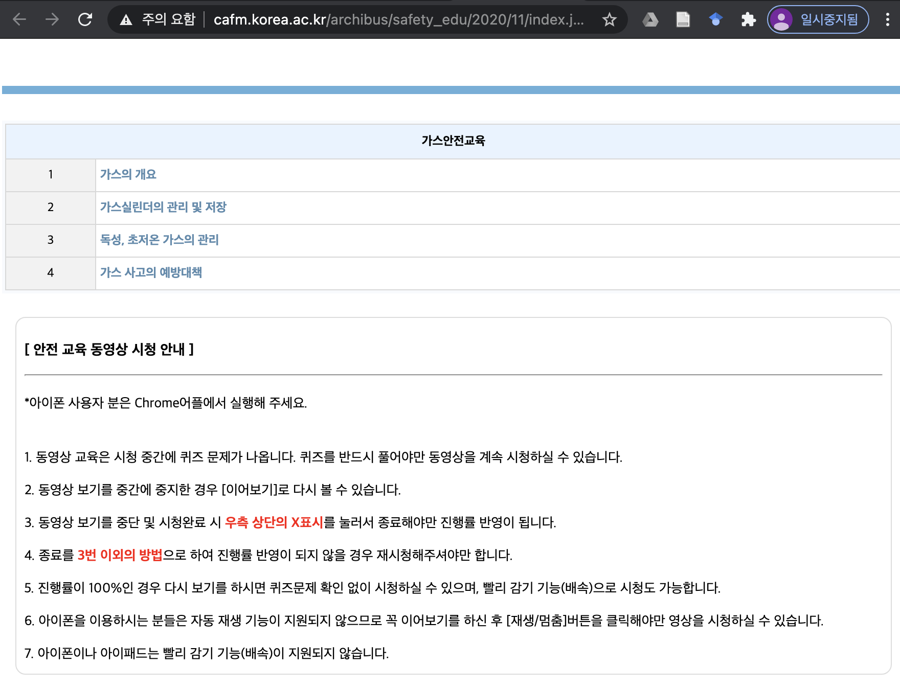

실행법
===
1.	아래 그림의 페이지에서 개발자 도구 (Chrome 기준 F12)를 연다.

2.	개발자 도구에서 Console 탭으로 들어간다.
3.	링크의 코드를 입력한다. [Script](script/script1.js)
4.	링크의 코드에서 totalChapNum의 값을 총 챕터 갯수에 맞도록 수정한 후 코드를 입력한다. [Script](script/script2.js)
